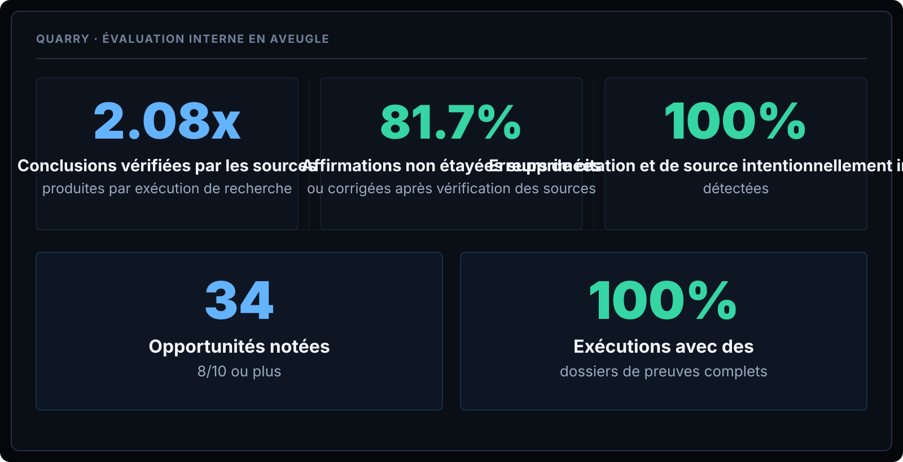
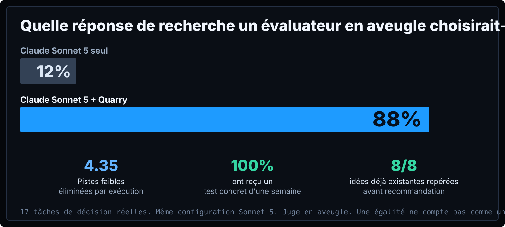

<div align="center">

### Quarry

# Trouvez ce que la recherche IA classique laisse passer.

Quarry transforme une recherche ouverte en opportunités solidement étayées, angles concurrentiels et prochaine action à entreprendre.

[English](../../README.md) · [简体中文](README.zh-CN.md) · [繁體中文](README.zh-TW.md) · [Español](README.es.md) · [हिन्दी](README.hi.md) · [العربية](README.ar.md) · [Português](README.pt-BR.md) · **Français** · [Deutsch](README.de.md) · [日本語](README.ja.md) · [한국어](README.ko.md) · [Русский](README.ru.md) · [Bahasa Indonesia](README.id.md)

</div>





```text
/plugin marketplace add AWF-Z/quarry && /plugin install quarry@quarry
```

*Internal blinded evaluation. Same task and model configuration; Quarry adds its research workflow.*

[Full documentation in English](../../README.md)
