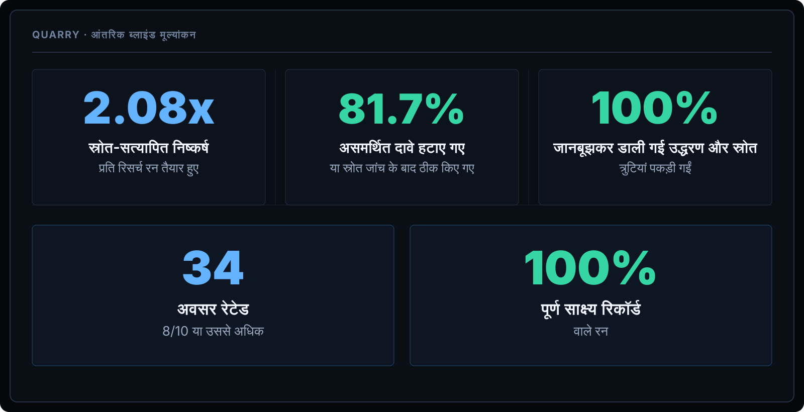
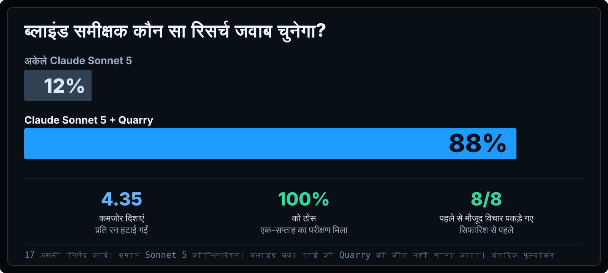

<div align="center">

### Quarry

# साधारण AI रिसर्च जो छोड़ देता है, वो खोजें।

Quarry ओपन-एंडेड रिसर्च को ठोस, प्रमाण-आधारित अवसरों, प्रतिस्पर्धी नज़रियों, और अगले उठाने लायक कदम में बदल देता है।

[English](../../README.md) · [简体中文](README.zh-CN.md) · [繁體中文](README.zh-TW.md) · [Español](README.es.md) · **हिन्दी** · [العربية](README.ar.md) · [Português](README.pt-BR.md) · [Français](README.fr.md) · [Deutsch](README.de.md) · [日本語](README.ja.md) · [한국어](README.ko.md) · [Русский](README.ru.md) · [Bahasa Indonesia](README.id.md)

</div>





```text
curl -fsSL https://raw.githubusercontent.com/AWF-Z/quarry/v1.0.3/install.py | python3
```

*Internal blinded evaluation. Same task and model configuration; Quarry adds its research workflow.*

[Full documentation in English](../../README.md)
