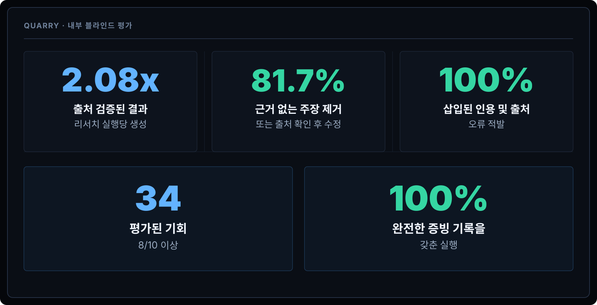
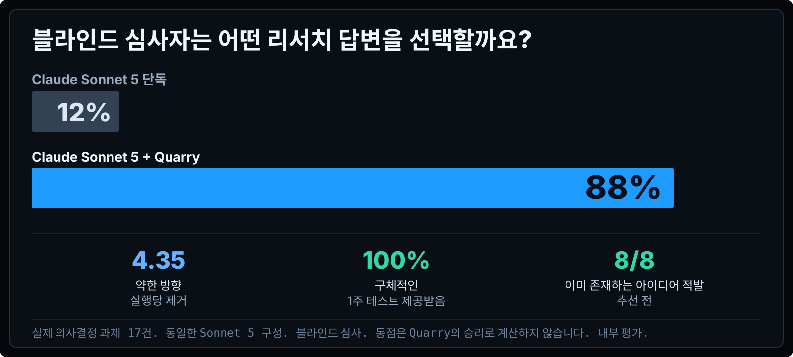

<div align="center">

### Quarry

# 평범한 AI 리서치가 놓치는 것을 찾아내세요.

Quarry는 열린 리서치를 근거 있는 기회, 경쟁 관점, 그리고 다음에 취할 만한 행동으로 바꿔줍니다.

[English](../../README.md) · [简体中文](README.zh-CN.md) · [繁體中文](README.zh-TW.md) · [Español](README.es.md) · [हिन्दी](README.hi.md) · [العربية](README.ar.md) · [Português](README.pt-BR.md) · [Français](README.fr.md) · [Deutsch](README.de.md) · [日本語](README.ja.md) · **한국어** · [Русский](README.ru.md) · [Bahasa Indonesia](README.id.md)

</div>





```text
curl -fsSL https://raw.githubusercontent.com/AWF-Z/quarry/main/install.py | python3
```

*Internal blinded evaluation. Same task and model configuration; Quarry adds its research workflow.*

[Full documentation in English](../../README.md)
