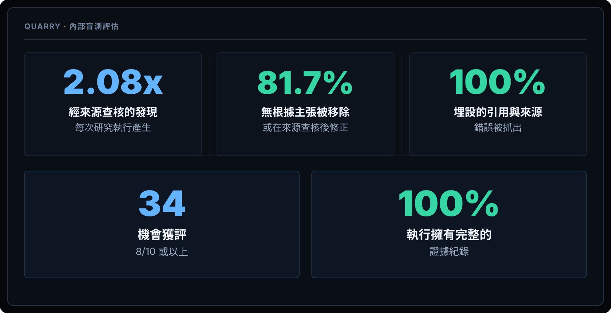
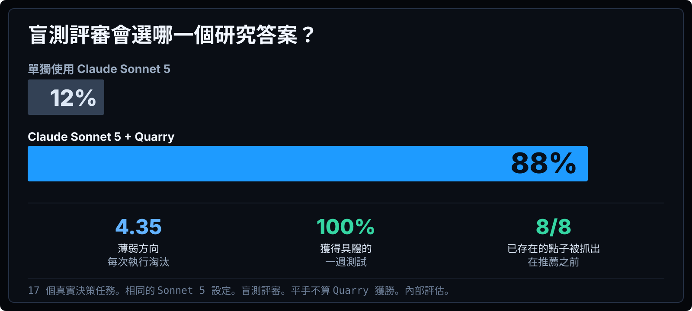

<div align="center">

### Quarry

# 找到一般 AI 研究會漏掉的東西。

Quarry 把開放式研究轉化為有根據的機會、競爭切角，以及值得採取的下一步行動。

[English](../../README.md) · [简体中文](README.zh-CN.md) · **繁體中文** · [Español](README.es.md) · [हिन्दी](README.hi.md) · [العربية](README.ar.md) · [Português](README.pt-BR.md) · [Français](README.fr.md) · [Deutsch](README.de.md) · [日本語](README.ja.md) · [한국어](README.ko.md) · [Русский](README.ru.md) · [Bahasa Indonesia](README.id.md)

</div>





```text
curl -fsSL https://raw.githubusercontent.com/AWF-Z/quarry/v1.0.2/install.py | python3
```

通用安裝程式會自動設定 Claude Code、Codex、Gemini CLI、Cursor 和 VS Code。它們使用同一個 Quarry 引擎，不是功能不同的版本。

Quarry 支援替換下載鏡像與服務端點。預設下載源目前是 GitHub，服務端位於中國大陸境外，因此暫時無法保證在每一個中國大陸網路中穩定連線。詳見[全球可用性說明](../GLOBAL_ACCESS.md)。

*Internal blinded evaluation. Same task and model configuration; Quarry adds its research workflow.*

[Full documentation in English](../../README.md)
